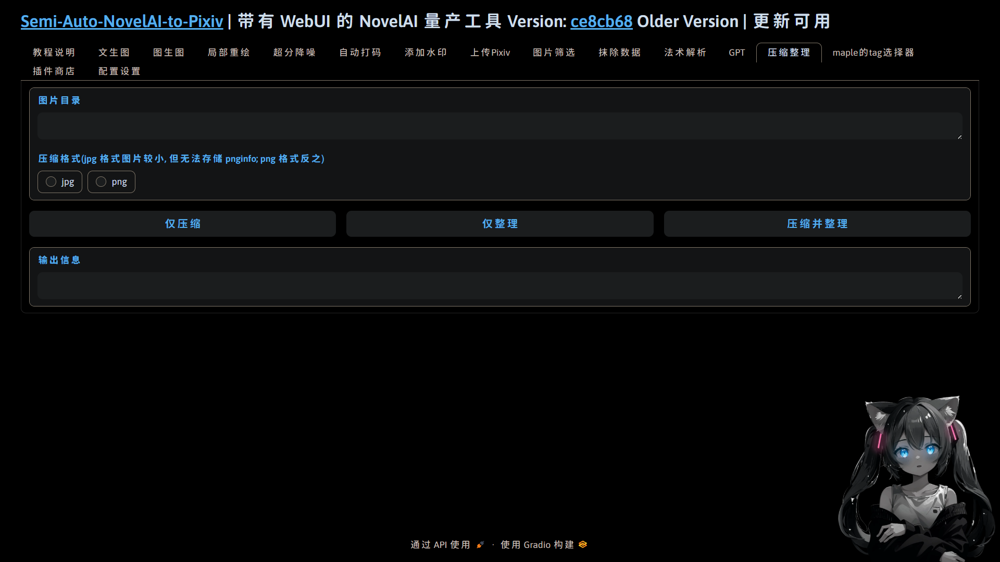

  </a>

<h1 align="center">sanp_plugin_image_compression</h1>
<h4 align="center">✨适用于 Semi-Auto-NovelAI-to-Pixiv 的图片压缩与整理插件✨</h4>

    
    
    
    
    

## 💬 介绍

使用 opencv 对图片进行保真压缩, 同时支持整理为 excel 表格

## ✨ 功能

## 💿 安装

- 方法1. 在插件商店粘贴本插件名字(sanp_plugin_image_compression)并点击安装

- 方法2. 在[主体项目](https://github.com/zhulinyv/Semi-Auto-NovelAI-to-Pixiv) `plugins\webui` 目录下直接克隆本项目

## 📖 待办

- [x] 图片整理支持压缩的 jpg 格式